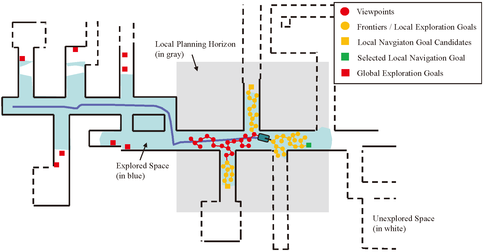

# Combining Spatial Clustering and Tour Planning for Efficient Full Area Exploration

This repository provides C++ code for autonomous exploration in both simulation and real-world settings on a mobile robot. This is the reference implementation for the paper which has been published on Robotica.

### Combining Spatial Clustering and Tour Planning for Efficient Full Area Exploration

Autonomous exploration in unknown environments has become a critical capability of mobile robots. Many methods often suffer from problems such as exploration goal selection based solely on information gain and inefficient tour optimization. Recent reinforcement learning based methods do not consider full area coverage and the performance of transferring learned policy to new environments cannot be guaranteed. To address these issues, a dual-stage exploration method has been proposed, which combines spatial clustering of possible exploration goals and Traveling Salesman Problem (TSP) based tour planning in both local and global scales, aiming for efficient full area exploration in highly convoluted environments. Our method involves two stages: exploration and relocation. During the exploration stage, we introduce to generate local navigation goal candidates straight from clusters of all possible local exploration goals. The local navigation goal is determined through tour planning, utilizing the TSP framework. Moreover, during the relocation stage, we suggest clustering all possible global exploration goals and applying TSP-based tour planning to efficiently direct the robot towards previously detected but yet-to-be-explored areas. The proposed method is validated in various challenging simulated and real-world environments. Experimental results demonstrate its effectiveness and efficiency. Videos and code for our method are available at https://github.com/JiatongBao/exploration.

<!--  -->
<div align="center"></div>
Fig.1 Overview of our method. The example environment which the robot is required to explore is shown as a 2D map. Explored areas are depicted in blue, while unexplored regions are represented by white spaces. Our method comprises two stages: the exploration stage and the relocation stage. During the exploration stage, an RRT is expanded within the local planning horizon, where each node serves as a viewpoint. Frontiers are identified from these viewpoints. The identified local frontiers are considered as possible exploration goals. They are clustered, with each cluster corresponding to a local navigation goal candidate. By using local tour planning, the optimal local navigation goal is selected for execution, considering the remaining goals as possible global exploration goals. Once no clusters in the local planning horizon remain, the robot switches to the relocation stage. In this stage, all updated global exploration goals are clustered and employed for global tour planning. The robot is then guided towards the selected global navigation goal. These two stages are executed back-and-forth until no global exploration goals remain.

## Videos
<b> Exploring in the simulated environments</b>

[](https://www.youtube.com/watch?v=6gFU1xZ8MiU " Explore in the simulated indoor environment ")

[](https://youtu.be/sTrAIejMLj4 "Explore in simulated campus environment")

[](https://www.youtube.com/watch?v=1TSQh2SxVJc "Explore in simulated garage environment")

<b>Exploring in a real underground parking lot environment</b>
<div align="center"></div>
Note: We took screenshots throughout our exploration and later compiled these key moments into a brief video.

## How to compile

- edit the file "src/dsvplanner/dsvplanner\include/dsvplanner/def.h"
- enable "#define NEW_METHOD" for running our method
- disable "#define NEW_METHOD" for running the original DSVP method
- we suggest set CLUSTERING_EPSILON = 2 for narrow environments and set CLUSTERING_EPSILON = 3 for spatious environments

```
cd exploration
catkin_make
```

## How to run
- launch the simulated environment from [autonomous_exploration_development_environment](https://github.com/HongbiaoZ/autonomous_exploration_development_environment)
```
roslaunch vehicle_simulator system_indoor.launch
```
- run the exploration planner
```
cd dsv_planner
catkin_make
source devel/setup.bash
roslaunch dsvp_launch explore_indoor.launch
```
- DO NOT forget to edit the "src/utils/lkh_tsp_solver/resource/single.par" and revise the file path according to your system environment.
```
PROBLEM_FILE = /home/ralab/Research/dsv_planner/src/utils/lkh_tsp_solver/resource/single.tsp
OUTPUT_TOUR_FILE =/home/ralab/Research/dsv_planner/src/utils/lkh_tsp_solver/resource/single.txt
```

## Citing

If you find this code useful in your work, please consider citing:
```
@article{bao2024explore, 
  title={Combining spatial clustering and tour planning for efficient full area exploration}, 
  DOI={10.1017/S0263574724001085}, 
  journal={Robotica}, a
  uthor={Bao, Jiatong and Mamun, Sultan and Bao, Jiawei and Zhang, Wenbing and Yang, Yuequan and Song, Aiguo}, 
  year={2024}, 
  pages={1–19}
}
```

## Contact
If you have any questions or find any bugs, please let me know: [Jiatong Bao] jtbao[at]yzu[dot]edu[dot]cn


## Acknowledgement
The benchmark exploration dataset is from [autonomous_exploration_development_environment](https://github.com/HongbiaoZ/autonomous_exploration_development_environment).

Our planner code is based on [DSVP](https://github.com/HongbiaoZ/dsv_planner).
